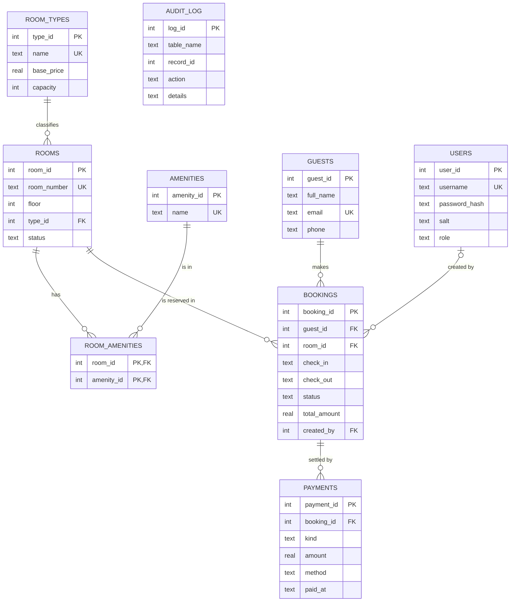

# Design Documentation

## 1. Architecture

```
 main.py ──> hotel/cli.py ──> service modules ──> hotel/db.py ──> SQLite file
 (menus)     (input/output)   bookings, rooms,     (connection,      data/hotel.db
                              guests, auth,         transactions)         ▲
                              reports                                     │
                                                    sql/schema.sql  tables + constraints + indexes
                                                    sql/triggers.sql business rules
                                                    sql/views.sql    read models
```

**Principle:** rules that must *always* be true live in the database (constraints, triggers).
Python only handles what needs calculation or today's date (pricing, refund percentage).

## 2. ER Diagram



## 3. Normalization

| Form | How the schema satisfies it |
|------|-----------------------------|
| 1NF  | Every column is atomic. Amenities are **not** stored as a comma list in `rooms`; they get their own rows. |
| 2NF  | In `room_amenities` (composite key) there are no other columns, so no partial dependency. All other tables have single-column keys. |
| 3NF  | Room price/capacity depend on the room *type*, not the room, so they live in `room_types`. Guest details are in `guests`, not repeated per booking. |

**Deliberate denormalization:** `bookings.total_amount` stores the price at booking time.
If the base price changes next month, old bookings must keep the price the guest agreed to.

## 4. Constraints

| Kind | Examples |
|------|----------|
| PRIMARY KEY / UNIQUE | `rooms.room_number`, `guests.email`, `users.username` |
| FOREIGN KEY | `ON DELETE RESTRICT` for bookings/payments (history cannot vanish), `CASCADE` for `room_amenities` |
| CHECK | `check_out > check_in`, `base_price > 0`, status/role/method enums, e-mail and date format patterns |
| NOT NULL / DEFAULT | all mandatory columns, `created_at DEFAULT datetime('now')` |

## 5. Triggers (sql/triggers.sql)

| Trigger | Purpose |
|---------|---------|
| `trg_booking_no_overlap_ins/_upd` | Reject a booking if an active booking for the same room has `new.in < old.out AND new.out > old.in` |
| `trg_booking_room_usable` | No bookings on rooms in maintenance |
| `trg_room_maintenance_guard` | Cannot send a room with upcoming bookings to maintenance |
| `trg_booking_status_flow` | Enforces CONFIRMED → CHECKED_IN → CHECKED_OUT and CONFIRMED → CANCELLED only |
| `trg_payment_guard` | No payment on cancelled booking, no overpayment, no refund above amount paid |
| `trg_audit_*` | Writes to `audit_log` automatically on booking creation, status change and payments |

## 6. Views (sql/views.sql)

- `v_booking_details`: 4-table join plus a correlated subquery for net amount paid
- `v_revenue_by_room_type`: LEFT JOINs + GROUP BY so room types with no revenue still appear
- `v_outstanding_balances`: filters the view above

## 7. Transactions

`db.transaction()` issues `BEGIN IMMEDIATE ... COMMIT`, or `ROLLBACK` on any exception.

- **Atomicity:** cancelling a booking updates its status *and* inserts the refund together.
- **Isolation:** `BEGIN IMMEDIATE` takes the write lock first, so two terminals cannot both
  pass the availability check and both insert (the classic check-then-act race).
- **Consistency:** constraints and triggers reject invalid states, which triggers a rollback.
- **Durability:** SQLite writes to disk on commit.

## 8. Indexing

`idx_bookings_room_dates (room_id, check_in, check_out)` serves the overlap trigger and the
availability search. Confirm with the SQL console:

```
sql> explain SELECT * FROM bookings WHERE room_id = 1 AND check_in < '2030-01-01'
SEARCH bookings USING INDEX idx_bookings_room_dates (room_id=? AND check_in<?)
```

## 9. Interesting queries

```sql
-- Availability: rooms with NO overlapping active booking (NOT EXISTS anti-join)
SELECT r.room_number FROM rooms r
WHERE r.status = 'AVAILABLE' AND NOT EXISTS (
    SELECT 1 FROM bookings b
    WHERE b.room_id = r.room_id AND b.status IN ('CONFIRMED','CHECKED_IN')
      AND :ci < b.check_out AND :co > b.check_in);

-- Ranking guests by spend (window function)
SELECT RANK() OVER (ORDER BY SUM(net_paid) DESC) AS rank, guest, SUM(net_paid)
FROM v_booking_details GROUP BY email;

-- Occupancy clipped to a reporting period
SUM(MAX(0, julianday(MIN(check_out, :end)) - julianday(MAX(check_in, :start))))
```

## 10. Security

Passwords use salted PBKDF2-HMAC-SHA256 (120k iterations) with constant-time comparison.
All SQL uses bound parameters (no string-built queries). The admin SQL console opens a
second connection in `mode=ro`, so it physically cannot modify data.
